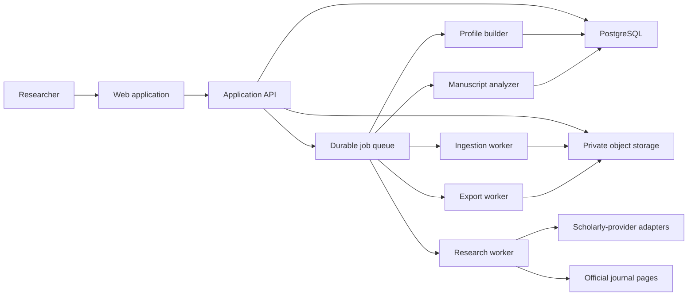

# Architecture

## Product boundary

Article Fit accepts a manuscript (`.docx` or text-extractable PDF), three user-supplied journal articles (PDF), and a confirmed target journal. It gathers traceable journal evidence, builds or improves a shared journal profile, analyzes the private manuscript, and exports a revised DOCX/PDF plus an evidence-backed revision report.

## Architectural principles

- Evidence before generation: no recommendation enters an output without a traceable basis or an explicit expert-judgment label.
- Private manuscripts are ephemeral inputs; shared journal knowledge contains derived conclusions only.
- Temporary source snapshots feed versioned, reviewable profiles and are deleted after rule extraction.
- Deterministic checks handle format constraints; language models handle bounded interpretation and drafting.
- Every long-running stage is resumable, idempotent, observable, and independently testable.
- Provider interfaces prevent lock-in to a single search, extraction, storage, or model vendor.

## Proposed technology baseline (to confirm in Change 001)

- Web: Next.js with TypeScript.
- API/workers: Python with FastAPI and a durable job queue.
- Database: PostgreSQL with vector search only where semantic retrieval is justified.
- Object storage: S3-compatible private buckets with encryption and signed URLs.
- Document processing: isolated Python adapters for PDF/DOCX extraction and generation.
- Deployment: containerized web, API, and worker services; managed PostgreSQL/object storage.

This is a recommendation, not an installed stack. Provider and hosting choices remain open until approval.

## Logical components



## Processing flow

1. Validate files, malware-scan, hash, store temporarily in a private bucket, and create a job.
2. Extract layout-aware text and section structure; retain page/paragraph anchors.
3. Resolve and confirm journal identity (canonical title, ISSN, publisher, official domain).
4. Search for up to three eligible articles published within the rolling five-year window. Prefer official open full text; otherwise resolve lawful repositories or author manuscripts, including strongly matched arXiv versions.
5. Capture the official scope and author-guide pages with URL, retrieval time, content hash, and relevant quoted fragments within permitted limits.
6. Analyze at least the three private user uploads and enrich the sample with up to three discovered sources. Produce bounded structural/style features and evidence links, reporting the actual sample size.
7. Load the current versioned journal profile; propose a new candidate profile; validate provenance and confidence; then publish it atomically.
8. Compare the private manuscript against journal requirements and the profile. Separate deterministic violations from model-based recommendations.
9. Generate proposed revisions, a change ledger, and DOCX/PDF outputs. Run integrity checks and require the user to review material scientific edits.
10. Hard-delete uploaded objects and extracted private text at terminal success, cancellation, or final failure. Keep generated downloads for at most 24 hours, then hard-delete the private project and its artifacts.

## Data model

Core entities:

- one fixed MVP workspace behind the server proxy; no end-user identity or login in the MVP
- `journals` (canonical identity, ISSNs, official domain)
- `journal_sources` (URL/DOI, source type, dates, hashes, license/access status)
- `journal_profile_versions` (derived rules, evidence map, confidence, supersession)
- `profile_observations` (feature, value, evidence, extraction method)
- `projects` and `analysis_jobs`
- `documents` and `document_versions` (private storage references, hashes, ownership)
- `document_segments` (page/paragraph/section anchors)
- `recommendations` (category, severity, rationale, evidence, confidence, approval state)
- `citations` (claim-to-source mapping)
- `artifacts` (DOCX, PDF, report, validation state)
- `audit_events` (actor, action, time, non-secret metadata)

Raw private document text, filenames, hashes, private evidence identifiers, manuscript recommendations, and generated outputs must not be stored in shared profile tables. The durable profile keeps only derived journal conclusions, official rules, public provenance, aggregate sample counts, confidence, timestamps, and a revision number. The single current profile head is keyed by confirmed journal identity, normally ISSN; a superseded revision survives only while a temporary output references it and is then pruned.

## Journal profile schema (conceptual)

- Identity and profile version.
- Official aims/scope facts.
- Submission and formatting requirements with effective/retrieval dates.
- Article architecture patterns by article type.
- Abstract, introduction, methods, results, discussion, and conclusion observations.
- Language, stance, tense, voice, terminology, and reporting patterns.
- Tables, figures, statistics, references, declarations, and supplementary-material conventions.
- Evidence coverage, sample characteristics, confidence, contradictions, and known gaps.

Profiles describe observed tendencies; they must not present a six-article sample as a universal rule.

## Security and privacy

- The public MVP has no user login. Vercel authenticates to the private API with a server-only credential and a fixed workspace; direct browser-to-Supabase/API access remains denied.
- Encryption in transit and at rest; secrets reside in a managed secret store.
- Signed, short-lived artifact URLs; no public upload bucket.
- File-type verification, malware scanning, size/page limits, parser sandboxing, and prompt-injection defenses for document/web content.
- Model requests exclude unnecessary personal data and use approved retention settings.
- Terminal processing deletes source originals and extracted text immediately. A scheduled safety purge hard-deletes any project, generated artifact, or orphaned upload by 24 hours.
- Audit access to manuscripts and profile publication.

## Reliability and observability

- Stage-level job state, retries with backoff, dead-letter handling, cancellation, and idempotency keys.
- Structured logs without manuscript text, distributed traces, provider latency/error metrics, queue depth, cost per job, source coverage, and export-validation rates.
- Reproducibility manifest per output: input hashes, profile version, source snapshots, prompt/template versions, model identifier, and validation results.

## Proposed repository structure (created only after Change 001 approval)

```text
apps/
  web/                    # UI and server-side web boundary
  api/                    # FastAPI HTTP API
  worker/                 # asynchronous orchestration entrypoint
packages/
  contracts/              # versioned API/event schemas
  ui/                     # shared UI components
services/
  ingestion/              # PDF/DOCX validation and extraction
  journal_research/       # discovery and official-page acquisition
  journal_profile/        # evidence aggregation and profile versioning
  manuscript_analysis/    # compliance and editorial analysis
  document_export/        # DOCX/PDF and change ledger generation
  providers/              # search, repository, LLM, storage adapters
db/
  migrations/
  seeds/                  # synthetic/test-only reference data
tests/
  contract/
  integration/
  e2e/
  fixtures/               # synthetic/licensed fixtures only
infra/
  containers/
  environments/
scripts/
docs/
.specs/
```

## Key risks

- Publisher rights: mitigate with lawful access adapters, license metadata, and no paywall bypass.
- Scientific harm: label scientific-content edits, preserve original text, require author approval, and never fabricate citations/results.
- Source drift: version official pages and time-stamp every rule.
- Small/non-representative samples: expose coverage and confidence; separate official rules from observed patterns.
- Layout loss in PDF inputs: prefer DOCX for editable output and warn when round-trip fidelity cannot be guaranteed.
- Cost/latency: cache lawful journal evidence, deduplicate by hashes/identifiers, and use stage-specific model budgets.
